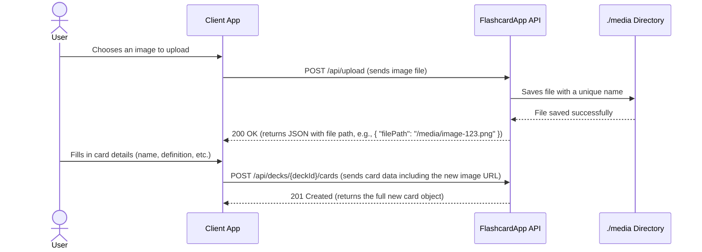
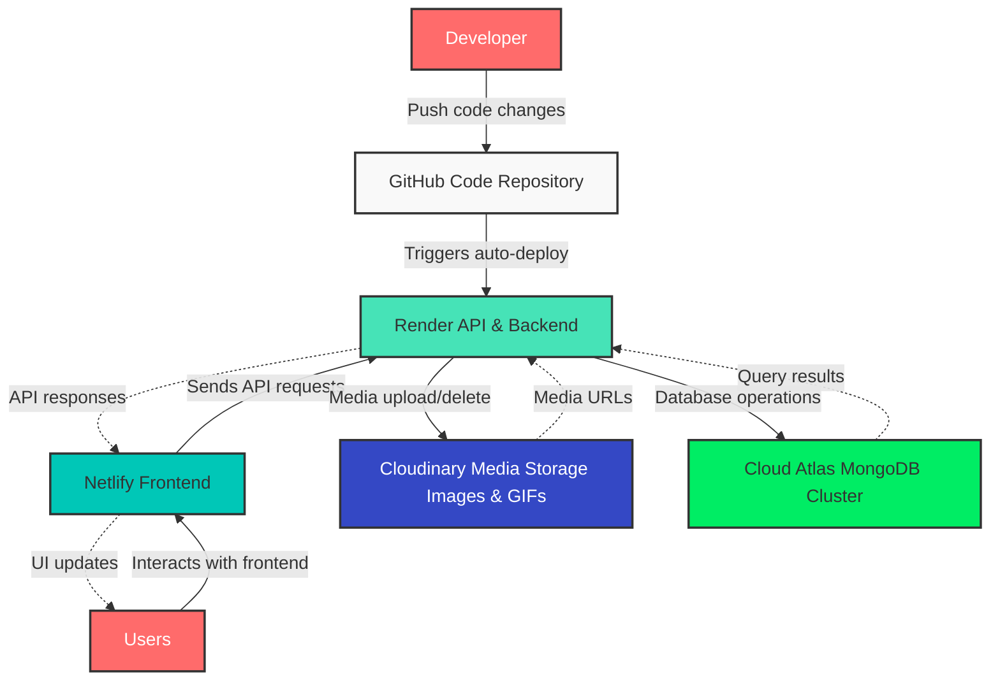

## Class diagram
```mermaid
classDiagram
    class User {
        +ObjectId _id
        +String username
        +String name
        +String email
        -String passwordHash
        +Boolean emailConfirmed
        +Date createdAt
        --
        +register(username, name, email, password)
        +login(email, password)
        +updateUserProfile(data)
        +deleteUser()
    }

    class Deck {
        +ObjectId _id
        +ObjectId user_id
        +String name
        +Sting URL 
        +String description
        +Number size
        +Date createdAt
        +Date updatedAt
        --
        +createDeck(name, description)
        +getDecks()
        +getDeckById(deckId)
        +updateDeck(deckId, data)
        +deleteDeck(deckId)
        +createReviewSession(deckId, settings)
    }

    class Card {
        +ObjectId _id
        +ObjectId deck_id
        +String name
        +String definition
        +String word_type
        +String url
        +String hint
        +String[] example
        +String[] category
        +Number frequency
        +Date createdAt
        +Date updatedAt
        --
        +addCardToDeck(deckId, cardData)
        +getCardsInDeck(deckId)
        +updateCard(cardId, data)
        +deleteCard(cardId)
        +submitCardReview(cardId, result)

        class DefaultDeck {
                +ObjectId _id
                +String name
                +Sting URL 
                +String description
                +Number size
                +Date createdAt
                +Date updatedAt
                --
                +createDeck(name, description)
                +getDecks()
                +getDeckById(deckId)
                +updateDeck(deckId, data)
                +deleteDeck(deckId)
                +createReviewSession(deckId, settings)
        }

        class DefaultCard {
            +ObjectId _id
                +ObjectId deck_id
                +String name
                +String definition
                +String word_type
                +String url
                +String hint
                +String[] example
                +String[] category
                +Number frequency
                +Date createdAt
                +Date updatedAt
                --
                +addCardToDeck(deckId, cardData)
                +getCardsInDeck(deckId)
                +updateCard(cardId, data)
                +deleteCard(cardId)
                +submitCardReview(cardId, result)
        }


    }

    User "1" -- "0..*" Deck : owns
    Deck "1" -- "0..*" Card : contains
    DefaultDeck "1" -- "0..*" DefaultCard : contains
```
## System Sequence Diagram


## Sequence Diagram for Creating a Card with an Image


## Flowchart for Review Session Generation
This flowchart shows how the backend generates a custom review session based on user-specified methods and sizes.

```mermaid
graph TD
    A[Start: User requests a review session] --> B["Client sends request:<br>POST /api/decks/{id}/review-session<br>Body: { flashcard: 10, mcq: 5 }"];
    B --> C[Server: Validate Deck Ownership & Request Body];
    C --> D[Server: Calculate `totalSize` (e.g., 10 + 5 = 15)];
    D --> E[Server: Fetch all cards from the specified deck];
    E --> F["Server: Create a weighted pool of cards<br>based on each card's 'frequency' score"];
    F --> G["Server: Shuffle the weighted pool<br>and select `totalSize` unique cards for the session"];
    G --> H[Server: Shuffle the final session pool of 15 cards];
    
    H --> I{Assign cards to methods};
    I -- flashcard: 10 --> J["Take first 10 cards from pool<br>Format as standard card objects"];
    I -- mcq: 5 --> K["Take next 5 cards from pool"];
    
    K --> L["For each of the 5 cards:<br>1. Get 3 random distractor definitions<br>2. Create MCQ question object<br>3. Shuffle answer options"];
    
    J --> M[Build Final Response Object];
    L --> M;
    
    M --> N["Server sends response:<br>{ flashcard: [...], mcq: [...] }"];
    N --> O[End];
```

## Interaction Diagram (for Card Review)


## Flowchart for Card Frequency Update Logic
This flowchart shows how the backend calculates a card's new frequency based on user input from different review methods.


## Sơ đồ Luồng Cập nhật Tần suất Thẻ (Tiếng Việt)
Sơ đồ này minh họa cách backend tính toán tần suất mới cho một thẻ dựa trên đầu vào của người dùng từ các phương pháp ôn tập khác nhau.

```mermaid
graph TD
    A[Bắt đầu: Người dùng gửi kết quả ôn tập thẻ] --> B{Phương pháp ôn tập là gì?};

    B -- "Flashcard Tiêu chuẩn" --> C["Người dùng cung cấp `retrievalLevel` (easy/medium/hard)<br>và `hintWasShown` (true/false)"];
    B -- "Trắc nghiệm / Điền vào chỗ trống" --> D{Câu trả lời có khách quan đúng không?};

    D -- "Đúng" --> E["Đặt `retrievalLevel` = 'easy'<br>Đặt `hintWasShown` = false"];
    D -- "Sai" --> F["Đặt `retrievalLevel` = 'hard'<br>Đặt `hintWasShown` = false"];

    C --> L;
    E --> M;
    F --> M;

    subgraph "Logic Tính toán Tần suất ở Backend (adjustLvl)"
        L{"`hintWasShown` là TRUE<br>Kiểm tra `retrievalLevel`"};
        M{"`hintWasShown` là FALSE<br>Kiểm tra `retrievalLevel`"};

        L -- "easy" --> N_NoChange1["Không đổi"];
        L -- "medium" --> O["freq = freq + 1"];
        L -- "hard" --> P["freq = freq + 2"];

        M -- "easy" --> Q["freq = freq - 1"];
        M -- "medium" --> R_NoChange2["Không đổi"];
        M -- "hard" --> S["freq = freq + 1"];

        N_NoChange1 --> T[Áp dụng thay đổi đã tính];
        O --> T;
        P --> T;
        Q --> T;
        R_NoChange2 --> T;
        S --> T;

        T --> U["Giới hạn Tần suất (Đảm bảo 1 <= freq <= 5)"];
        U --> V["Lưu Tần suất mới vào Cơ sở dữ liệu"];
        V --> W[Kết thúc];
    end
```

## Cloud Service Infrastructure

